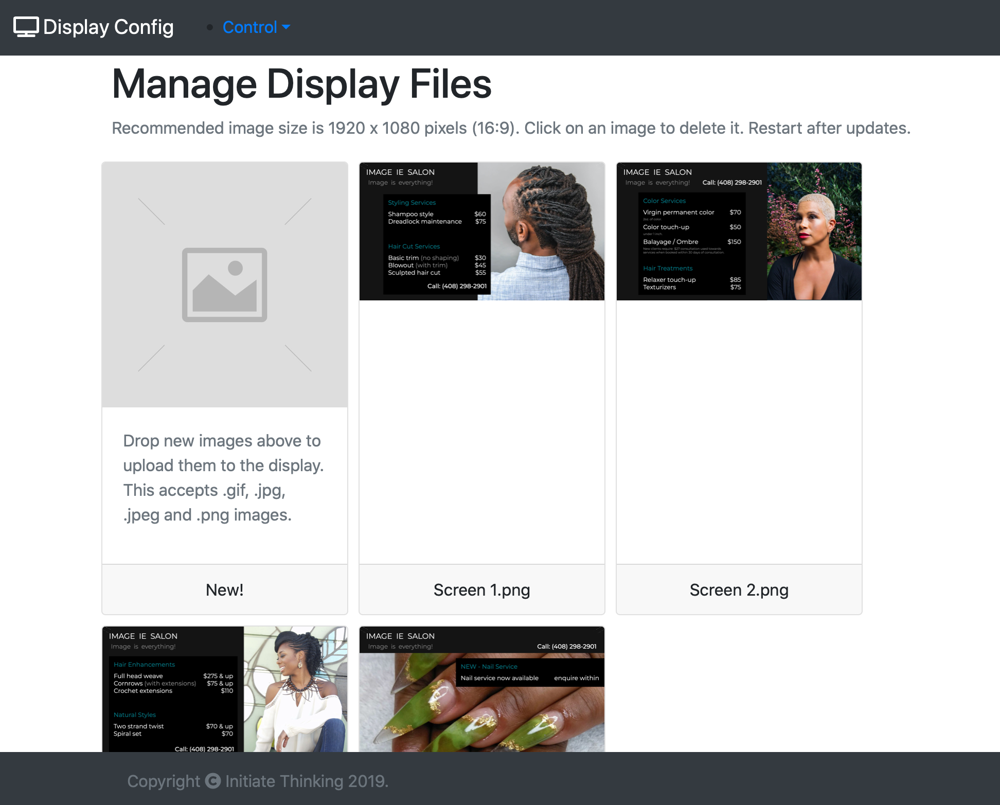
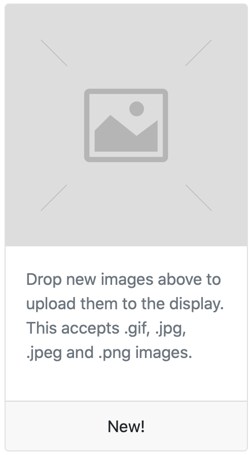
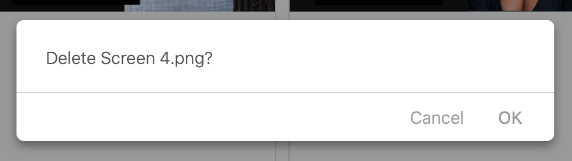
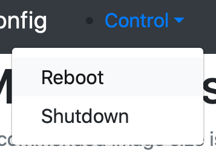

# Display Manual
This manual is instructions for configuring and using the display system
## Images
The system will display random images uploaded to computer running the show, these are best uploaded at 1920 x 1080 pixels as that's the screen resolution.  Images that are a ratio of 16:9 will be scaled up to fit to fill the screen.  However, if the  image resolution is to low images may look bitty when scaled up to fill the screen.
## Initial Configuration
The system needs to be added to your network for this a keyboard will need to be attached.  This is a one time configuration step, unless the network is changed. When the system is started it automatically starts up the server and begins to display images. When the system has started hitting ctrl^C will quit the server. From the command line you can now run the command:

`sudo raspi-config`

This will start up the RaspberryPi configuration tool and this can be used to add the computer to your wireless network.  Once this has been done the system can be restarted:

`sudo reboot now`

On restart the system should start and automatically join your network.
## Managing Images
To manage the system when it's up and running can be done remotely using your browser. To connect to the display ensure you are connected to the same network and go to the following address:

[http://display.local](http://display.local)

When open this page you will see the following display:

### Adding an Image
To add an image drag any image you want to add onto the top part of this card:

As the image is dragged over the correct area it will glow a green color if the image is of an acceptable type.  The image needs to be a GIF, JPEG or PNG format image to be accepted.  Any other file type will cause the area to glow red and will not be uploaded when dropped.  When a file of the correct type is dropped on this area the system will upload the image and add it to the displayed cards.
### Deleting an Image
To delete an image simply click on it's card, when you do this a pop up will appear asking if the image should be deleted:

Clicking `OK` results in that image being deleted.
### Reloading Images
Once you are happy that you have all made all of the changes you want then the system needs to be restarted.  The `Control` menu in the top left of the screen can be used to do this.  Clicking on this menu brings up the following options:

Selecting the `Reboot` option will restart the system and load the new images and/or no longer display old ones.
### Stopping the Display
The `Control` menu can also be used to stop the display system by selecting the `Shutdown` option.  It is recommended this is used prior to powering off the system.
